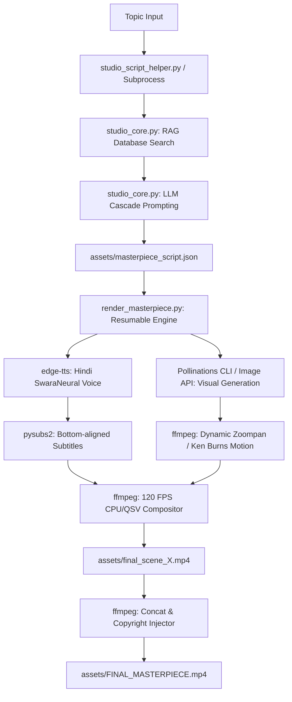

# Anime Studio 3.0: Hindi 120FPS "Studio-on-a-Stick"

Anime Studio 3.0 is a professional, fully automated, and 100% free cartoon generation pipeline. Designed to operate on constrained hardware (12GB RAM, CPU/NVIDIA MX230 GPU), it utilizes highly optimized visual generation fallbacks, localized vector RAG loops, and 120 FPS frame interpolation to produce continuous, 4-5 minute, high-fidelity kids' cartoon animations with realistic Hindi vocals.

> **Production Pipeline Notice**: The Python CLI pipeline (`orchestrator.py` / `studio_core.py` / `youtube_publish.py`) is the **sole production pipeline**. The prior experimental Node.js/Remotion pipeline has been consolidated and archived under `_archive/nodejs_remotion_pipeline/`.

---

## 🏗️ System Architecture



---

## 📦 Package Walkthrough & Mechanisms

Below is a detailed breakdown of each package used in the pipeline and how it works under the hood:

### 1. `sentence-transformers` (Model: `all-MiniLM-L6-v2`)
* **Role:** Local Text Vector Embeddings.
* **Mechanism:** Converts raw textual themes or topic inputs into dense numerical arrays of 384 dimensions. To bypass the Windows Proactor event loop deadlock, it is lazily initialized and runs on a single CPU thread thread-safely.
* **Working:** 
  ```python
  from sentence_transformers import SentenceTransformer
  model = SentenceTransformer("all-MiniLM-L6-v2", local_files_only=True)
  embeddings = model.encode(text).tolist()
  ```

### 2. `sqlite-vec` & `sqlite3`
* **Role:** Zero-RAM Local Vector Search Engine (RAG).
* **Mechanism:** Loads the lightweight virtual table extension `vec0` directly into standard SQLite. It performs 1-bit quantization (converting float coordinates into a 48-byte binary bitmask) and queries the database using `vec_distance_hamming()` to find historical high-retention script beats.
* **Working:**
  ```python
  db.enable_load_extension(True)
  sqlite_vec.load(db)
  db.execute("CREATE VIRTUAL TABLE vec_analytics USING vec0(embedding bit[384], +video_id TEXT, +performance_data TEXT)")
  ```

### 3. `edge-tts`
* **Role:** Realistic Hindi Vocal Synthesis.
* **Mechanism:** Queries the unauthenticated Microsoft Edge Neural TTS service directly, using `hi-IN-SwaraNeural` (Indian female voice) with a `+5%` rate speed-up, yielding a natural narration flow.
* **Working:** Streams raw audio chunks and maps boundaries to SRT subtitles:
  ```python
  communicate = edge_tts.Communicate(text, "hi-IN-SwaraNeural", rate="+5%")
  async for chunk in communicate.stream():
      if chunk["type"] == "audio":
          audio_file.write(chunk["data"])
  ```

### 4. `pysubs2`
* **Role:** Cinematic Subtitle Formatting.
* **Mechanism:** Parses the raw SRT timestamp markers and converts them to ASS format. It embeds custom subtitle tokens like yellow fill color (`&H00FFFF&`), solid black outlines (`\bord2\b1`), small font sizing (`\fs22`), and bottom-center alignment (`\an2`) for a premium layout.
* **Working:**
  ```python
  subs = pysubs2.load("raw.srt", encoding="utf-8")
  for line in subs:
      line.text = r"{\an2\fs22\1c&H00FFFF&\3c&H000000&\bord2\b1}" + line.text
  subs.save("styled.ass")
  ```

### 5. `ffmpeg` & `ffprobe`
* **Role:** Zoompan Engine, 120 FPS Compositing, Subtitle Burn-In, and Concatenation.
* **Mechanism:** 
  * **Dynamic Zoompan:** Scales the reference image to 3840x2160 and applies a sub-pixel panning and zooming filter (`zoompan=z='min(zoom+0.0003,1.3)'`) for exactly the calculated length of the audio track, avoiding unnecessary render loops.
  * **120 FPS Compositing:** Smoothly interpolates the scene video to 120 FPS using `-vf fps=fps=120`, burns in styled ASS subtitles, merges the edge-TTS audio, and limits output to the shortest stream (`-shortest`).
  * **Metadata Injection:** Injects `-metadata copyright="Owned by Creator"` into the MP4 container for copyright protection.

### 6. `@pollinations/cli`
* **Role:** Multi-frame Moving Animation Generation (Wan / LTX-2).
* **Mechanism:** When `POLLINATIONS_KEY` is present in the `.env` configuration file, the pipeline spawns `npx @pollinations/cli` to request actual multi-frame AI video sequences. It feeds the unauthenticated style-anchored image URL as a reference frame (`--image`), forcing visual consistency across the generated video clips.
* **Working:**
  ```bash
  npx @pollinations/cli gen video --key "sk_..." --model "wan" --width 1024 --height 576 --duration 6 --image "https://image.pollinations.ai/..." --output "scene.mp4" "prompt"
  ```

---

## 🛠️ File Walkthrough

### 1. `studio_core.py`
The core engine containing all rendering routines:
* `generate_hindi_script(topic)`: Crafts 6 consecutive chapters (5 scenes each) with a 5-second sleep delay to avoid rate limits, fallback templates, and seed style injection.
* `generate_anime_video(prompt, filename, duration)`: Generates real moving clips via CLI or builds zoompan fallbacks from static images.
* `synthesize_hindi_audio(text, base_filename)`: Performs voiceovers and applies ASS subtitle styles.
* `render_scene_120fps(...)`: Composites 120 FPS video, audio, subtitles, and metadata.
* RAG modules: Functions to setup, ingest, and query vector script records.

### 2. `render_masterpiece.py`
The space-saving standalone render coordinator:
* Reads `assets/masterpiece_script.json`.
* Performs a **resumability check** (skips already rendered `.mp4` scene files on disk).
* Cleans up temporary `.mp3`, `.srt`, and `.ass` files post-compositing to preserve RAM and storage.
* Concatenates all scene parts into `assets/FINAL_MASTERPIECE.mp4` with final metadata tags.

### 3. `orchestrator.py`
Exposes the main pipeline hook. Automatically launches the script helper as a separate process and runs the scene assembly.

### 4. `studio_script_helper.py`
A subprocess-isolated CLI script to query database records and run LLM cascades. Bypasses event loop conflicts by executing in a fresh Python process.

### 5. `studio_mcp.py`
A FastMCP HTTP server listening on `http://0.0.0.0:8000/mcp`. Exposes video generation, audio synthesis, and RAG ingestion tool wrappers to n8n.

---

## 🚀 Execution & Setup Guide

### 1. Configure the Environment
Create a `.env` file in the project root:
```env
# OpenRouter Free Tier API Keys
OR_LLAMA_KEY=sk-or-YOUR_OPENROUTER_KEY...
OR_NEMOTRON_KEY=sk-or-YOUR_OPENROUTER_KEY...
OR_QWEN_KEY=sk-or-YOUR_OPENROUTER_KEY...

# Pollinations API Key (Required for real multi-frame moving video, optional for zoompan)
POLLINATIONS_KEY=sk_...

# System Configuration
STUDIO_ASSETS_DIR=assets
RAG_DB_PATH=analytics_rag.db
```

### 2. Run Standalone Masterpiece Renderer
1. Generate the 30-scene adventure script:
   ```bash
   .venv\Scripts\python.exe -u studio_script_helper.py --action generate --topic "magical forest adventure and friendship" --duration 4 --output assets/masterpiece_script.json
   ```
2. Compile and render the final movie:
   ```bash
   .venv\Scripts\python.exe -u render_masterpiece.py
   ```
3. Find your completed movie at `assets/FINAL_MASTERPIECE.mp4`.

### 3. Run the MCP Server for n8n Workflows
1. Start the HTTP MCP server:
   ```bash
   .venv\Scripts\python.exe -u studio_mcp.py
   ```
2. In n8n, connect to the server at `http://localhost:8000/mcp` and trigger workflow nodes.


