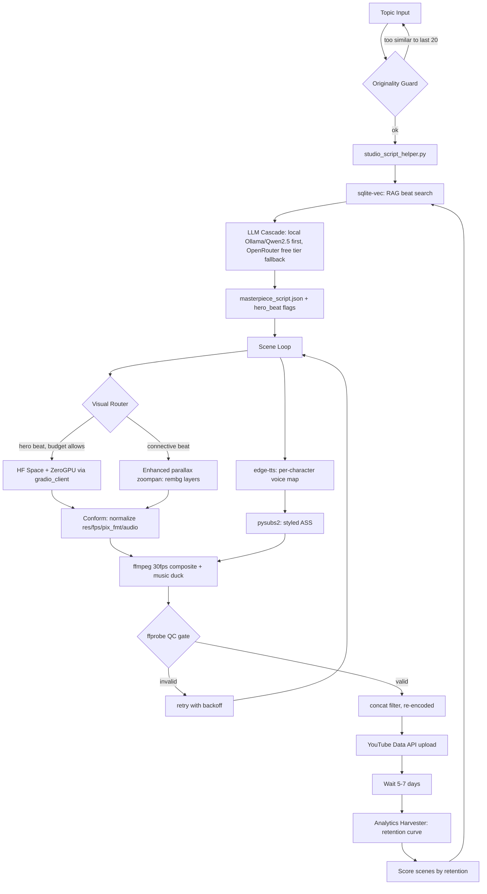

# Anime Studio 4.0 — Reliability, Realism & a Real Growth Loop

A rebuild plan for the Hindi kids'-cartoon pipeline, written straight: what's actually broken, why, and what to do about it — including the parts of the original brief I'm not going to pretend are achievable.

---

## 0. The Honest Read (start here)

Four things are true at once, and everything below is built around all four of them.

**1. 120 FPS was never real, and dropping it fixes half your problems.** `-vf fps=fps=120` doesn't interpolate motion — it duplicates frames to hit a target count. On a slow Ken Burns pan there's no extra motion information to show at 120 vs 30fps, and on 12GB RAM / CPU it multiplies encode time for a difference nobody can see. This is very likely why renders are slow, stalling, or not completing.

**2. The reason it doesn't look "animated" is almost certainly that the real-video path is silently failing over to slideshow mode, every time.** Pollinations' actual moving-video models (Seedance, Veo, Wan-Fast) now live behind paid Pollen credits, not the free/anonymous tier — only image generation (Flux) and some text models are genuinely unlimited-free. If `POLLINATIONS_KEY` has $0 of Pollen behind it, every video call gets rejected and the pipeline quietly falls back to zoompan-on-a-still for the *entire* video. That's not a bug in your code — that's the fallback logic doing exactly what you told it to do when the paid path isn't funded.

**3. "10M views, guaranteed" isn't something any pipeline can promise — free, paid, or otherwise.** I'm not going to write you a plan that pretends otherwise. What I *can* do is build the system around the things that actually correlate with views — retention, click-through, consistency, format recognizability — and give you a feedback loop that's real instead of decorative.

**4. As designed, this would likely get the channel demonetized even if it somehow hit 10M views.** YouTube's monetization policy explicitly disqualifies "image slideshows... with minimal or no narrative" and "mass-produced content using a similar template across multiple videos," and it applies to your *whole channel*, not just one video. That's close to a literal description of the zoompan fallback running at scale. It's fixable, but it has to be designed in from the start, not patched on after the channel gets flagged.

None of this means start over. It means: stop chasing fps, fix the fallback chain so real motion actually happens when it's supposed to, build originality into the automation instead of bolting it on afterward, and wire "self-improvement" to real analytics data instead of an empty table. Here's the full rebuild.

---

## 1. Root Cause Map

| You reported | What's actually happening | Fix |
|---|---|---|
| Not hitting 120fps | `fps` filter duplicates frames, doesn't interpolate; 120fps is invisible on pan/zoom content and multiplies encode time for nothing | Drop to 30fps everywhere (§3) |
| Not "animated," doesn't feel real | Real video-gen is paid; at $0 Pollen balance every clip call fails and falls back to zoompan for the whole runtime | Tiered visual pipeline — real motion on hero beats, enhanced parallax elsewhere (§4) |
| Not reaching 4–5 min | Scene calls fail silently mid-run (rate limits, mismatched codecs breaking concat, "resumability" that only checks file *existence* not validity) | Conform pass + real retry/backoff + ffprobe-verified resumability (§5) |
| Doesn't feel real (audio) | Every character speaks in one edge-tts voice at one rate | Per-character voice map + music/SFX bed (§6) |
| Should "learn from outcomes" | `vec_analytics` is a schema with nothing writing to it — it's a table, not a loop | YouTube Analytics ingestion → scene-level retention scoring → RAG bias (§8) |

---

## 2. Updated Architecture



What's new versus v3.0, and why each piece exists:

- **Originality Guard** — a cheap embedding-similarity check against your last ~20 scripts before render starts. This is the difference between "a recognizable series format" (fine to monetize) and "a template repeated at scale" (explicitly not fine — see §9).
- **Conform stage** — every scene clip, whichever tier produced it, gets forced to one resolution/fps/pixel format/audio rate before concat. This alone probably fixes a chunk of your "video won't reach 4–5 minutes" problem.
- **Visual Router + two-tier generation** — spend real video-gen budget only where it's worth it; use a genuinely improved zoompan (not flat zoompan) everywhere else.
- **Analytics Harvester** — the piece that turns `vec_analytics` from a schema into an actual loop.

---

## 3. Fix A — Stop Chasing 120fps

Render everything at 30fps. It's the universal, fast, fully-compatible choice, and nothing about slow pans or dialogue scenes benefits from more:

```bash
ffmpeg -i scene_input.mp4 \
  -vf "fps=30,format=yuv420p" \
  -c:v libx264 -preset fast -crf 18 \
  -c:a aac -ar 48000 -ac 2 \
  scene_output.mp4
```

If a specific pan genuinely looks choppy and you want real smoothing (not just a bigger number), that's `minterpolate`, not `fps`:

```bash
-vf "minterpolate=fps=60:mi_mode=mci:mc_mode=aobmc:vsbmc=1"
```

This is true motion interpolation — CPU-only, several times slower than real-time on a laptop CPU. Use it selectively on 2–3 hero shots you can actually see the difference on, never as a blanket setting. For everything else, 30fps end to end, and your render times drop substantially just from this one change.

**On genuinely higher fps vs. "no frame drops," these are two different asks.** A video can sit at a plain 30fps and never stutter, and a video can target some huge fps number and still stutter, because playback smoothness comes from timing consistency and bitrate, not the fps label. Zoompan *can* legitimately render at 60fps — every frame is a freshly-computed pan position, so it's real smoothness, not duplication, and it's cheap since zoompan math costs far less than AI generation. AI-generated clips (Tier 1, below) are capped at whatever fps the source model produced; pushing those past their native rate without real `minterpolate` is duplication again. Worth noting: YouTube's own bitrate guidance only recognizes two tiers — standard (24/25/30) and high (48/50/60) — nothing above that, which is a good signal 60 is the real ceiling worth ever targeting.

**What actually prevents frame drops on mobile/TV:** constant frame rate (CFR) end to end, and enough bitrate/keyframe density for YouTube's adaptive streaming to switch quality cleanly instead of stuttering through a bandwidth dip. This is 100% free to get right regardless of budget:

```bash
ffmpeg -i "$SCENE_IN" \
  -vf "scale=1920:1080:force_original_aspect_ratio=decrease,pad=1920:1080:(ow-iw)/2:(oh-ih)/2,fps=30,format=yuv420p" \
  -fps_mode cfr \
  -g 60 -keyint_min 60 -sc_threshold 0 \
  -c:v libx264 -profile:v high -preset fast -crf 16 -maxrate 15M -bufsize 30M \
  -c:a aac -ar 48000 -ac 2 -b:a 384k \
  -movflags +faststart \
  "$SCENE_CONFORMED"
```

`-fps_mode cfr` forces genuinely constant frame rate (replaces the older `-vsync cfr`); `-g 60 -keyint_min 60 -sc_threshold 0` locks a keyframe every 2 seconds at 30fps, matching YouTube's own guidance. You don't need separate mobile vs. TV exports — YouTube re-encodes every upload into its own AV1/VP9/H.264 ladder and hands each device whichever rendition it can decode smoothly; your job is just handing it one clean CFR source. Target bitrates above YouTube's published floor for headroom through their re-encode: **12–15 Mbps for 1080p30, 15–18 Mbps for 1080p60.** And since the zoompan/parallax layers below are already rendered at 3840×2160 for pan room, deliver the final upload at that same 4K rather than downscaling — YouTube allocates more bitrate to higher-resolution uploads even for viewers watching at 1080p, and it costs nothing extra.

**If "30 feels low" keeps nagging, here's the actual nuance.** Camera pans at 30fps are imperceptibly smooth — that's not a compromise. Fast *subject* motion inside a clip is where 30 can genuinely show judder, same reason sports/gaming content runs at 60. But the thing most likely to actually look cheap isn't the 30 itself — it's Tier-1 AI clips (native 16 or 24fps from most Wan-style models) getting force-duplicated into a 30fps timeline instead of properly interpolated. Reserve `minterpolate` for exactly that seam — real upsampling on the AI clips specifically during conform, not a blanket setting — and that fixes the actual mismatch. Also worth knowing: higher frame rate isn't simply "more premium" for narrative content — it's a genuinely mixed aesthetic (see: The Hobbit's 48fps run being widely described as looking cheaper, not more cinematic — the "soap opera effect"), and traditional anime deliberately animates on 2s/3s rather than chasing fluid motion. The style you're going for doesn't actually want hyper-smooth motion everywhere.

---

## 4. Fix B — Actually Getting Motion, For Free

**Update, now that the real implementation exists and has been tested:** the two-tier system below has become three. The gap between "the code has a real-motion path" and "the rendered video is still mostly a slideshow" comes down to arithmetic — free HF ZeroGPU quota supports roughly 2-4 real Wan2.1 generations a day, and a 30-scene video needs ~30. That means 85-95% of scenes are structurally forced into whatever the fallback is, no matter how well the real-motion integration works. The fix isn't a better model — it's a better fallback than flat zoompan, which is what Tier 2 below now is.

**One thing worth being fully honest about, once:** none of this — free or paid, this pipeline or any other — gets you to the animation quality of a professional TV anime like Naruto, One Piece, or Black Clover. Those are studio productions with hundreds of trained animators and $100K-300K+ per-episode budgets, refined over decades, and fast dynamic fight choreography specifically is about the hardest target that exists for current AI video generation. That's a real ceiling, not a settings problem. What follows is the best achievable version within that ceiling — genuinely much better than a panned still image, not equivalent to hand-drawn shounen anime.


The core problem: Pollinations' video models (Seedance, Veo alpha, Wan-Fast, with keyframe start/end-frame support) are metered through Pollen credits — genuinely free access there covers image generation (Flux, unlimited) and lighter text models, not video. If you want real per-clip motion without paying, you need a different free source, and the honest constraint is that **every open video model capable of decent quality — LTX-Video, Wan 2.x, HunyuanVideo, Mochi, CogVideoX — needs a minimum of 8GB VRAM, most want 12–24GB.** An MX230's 2GB rules out local generation entirely, for any of them. This isn't a settings problem; it's a hardware ceiling. So: don't run video generation locally, and don't rely on a Pollen balance you're not funding. Use a hybrid tier system instead.

### Tier 1 — Hero beats: Hugging Face Spaces + ZeroGPU (genuinely free, quota-limited)

Hugging Face's ZeroGPU gives free, quota-limited shared-GPU access to Spaces built on Gradio. Community Spaces running Wan2.2 or LTX-Video image-to-video exist and are callable programmatically — not just through the web UI — using the `gradio_client` library:

```python
from gradio_client import Client, handle_file

# Search huggingface.co/spaces, filter by "Video", sort by recent —
# specific community Spaces come and go, so pick a currently-live one
client = Client("some-org/wan2-2-image-to-video")

result = client.predict(
    image=handle_file("assets/ref_frames/scene_04_hero.png"),
    prompt="character walks forward through forest, gentle camera pan, "
           "consistent flat-cel animation style, warm lighting",
    api_name="/generate",
)
```

**The real numbers, so you can plan around them instead of discovering them mid-render:** an unauthenticated caller gets ~2 minutes of ZeroGPU compute per day; sign in with a free `HF_TOKEN` and that becomes ~3.5 minutes/day — worth doing immediately, it costs nothing. HF PRO ($9/mo) advertises 8× that (25 min/day), though it's tied to your account regardless of which Space you call. Quota resets roughly 24 hours after your first use, and the errors you get back when you run out (`X requested vs. Y left`) tell you exactly how much a given call actually costs — read those numbers off your own test runs rather than guessing, they'll be more accurate than any estimate I give you here.

**This is the important correction:** ZeroGPU quota is tied to *you* (your account or IP), not to the specific Space. Calling `multimodalart/wan2-1-fast` vs. `rahul7star/wan2-1-fast` vs. any other fork draws from the exact same daily allowance if you're authenticated with the same token. Rotating between duplicate Spaces genuinely helps with **queue time** (you're not stuck behind everyone else piled onto the one popular fork) but does **not** multiply your actual daily compute — so it's a reasonable tactic for dodging congestion, not a scaling strategy. At a rough 8-second clip per call, ~3.5 minutes/day of free quota realistically buys **2–4 successful generations a day**, which settles the "6-10 clips per video" question from before: that volume of hero-tier motion accumulates over several days per video, not in one sitting, unless you loosen the free-only constraint.

**Make each precious generation count for more:** rather than spending a whole day's quota on one isolated 8-second clip, chain clips end-to-end using first/last-frame conditioning — feed a generated clip's last frame back in as the next clip's starting image with a continuation prompt, and 2–3 chained calls read as one continuous 15–24 second beat instead of three disconnected ones. You don't have to build this by hand: `linoyts/wan2-1-VACE-fast` is a community Space built specifically for first-last-frame and reference-frame video generation — worth trying directly instead of a plain image-to-video Space for hero beats.

A free but different-shaped alternative worth knowing about: Google Colab's free tier gives you your own T4 GPU (16GB, comfortably enough for Wan2.1's smaller variants), independent of the shared HF quota pool. The catch is it's built for interactive notebook sessions, not an always-on backend — Google throttles accounts that look like they're running it as unattended production infrastructure. Treat it as a manual batch tool (queue up a week's worth of hero shots, run them yourself in one sitting) rather than something n8n calls automatically, and it stays a reasonable, sustainable supplement rather than a ToS problem.

Net effect on the architecture from §2: Tier 1 still exists and is still worth using, but now that Tier 2 below exists, reserve Tier 1 for **1–3 true hero beats per video** — the single moment that most deserves fluid, real motion — accumulated across a few days, rather than expecting it on-demand inside a single automated render run. Everything else goes through Tier 2, not straight to zoompan.

### Tier 2 — Pose-sequence action beats (this is the actual "feels like a slideshow" fix)

This is the tier that was missing, and it's the one that matters most: most of a video's scenes are action or dialogue beats that need *something* to visibly happen, and neither "one AI video clip" (quota-limited to a handful per video) nor "one panned still" (reads as a slideshow) covers that gap on its own. The fix: generate 3–6 sequential pose stills of the same locked character performing the action — anticipation, peak action, impact, follow-through — using Pollinations' free, unlimited Flux endpoint with a fixed seed, a locked style-suffix string, and the character's reference image passed as conditioning on every call, then hard-cut the stills together. This isn't a workaround dressed up as a technique — held dramatic poses cut together fast is genuinely how a lot of real fight animation works during its biggest moments (impact frames), not just an AI-pipeline compromise.

```python
STYLE_SUFFIX = ("flat cel-shaded 2D anime style, bold clean linework, vibrant "
                "saturated colors, dynamic action pose, dramatic lighting, "
                "consistent character design")

def decompose_action_into_poses(action_description: str, n_poses: int = 4) -> list[str]:
    templates = [
        "{subject}, coiled and ready, anticipation pose, crouched stance",
        "{subject}, mid-action, dynamic motion blur lines, peak of the movement",
        "{subject}, at the moment of impact, dramatic emphasis, speed lines radiating outward",
        "{subject}, follow-through pose, aftermath stance, dust and energy effects settling",
    ]
    return [t.format(subject=action_description) for t in templates[:n_poses]]

# Each pose still is a normal Pollinations Flux call — free, unlimited — with
# the SAME seed and reference image on every call in the sequence, which is
# what keeps the character's face/outfit/palette consistent pose to pose.
```

Assembly (verified against ffmpeg 6.1.1 — produces a clean, correctly-timed CFR clip):

```bash
ffmpeg -y \
  -loop 1 -t 0.55 -i pose_0.png \
  -loop 1 -t 0.45 -i pose_1.png \
  -loop 1 -t 0.40 -i pose_2.png \
  -loop 1 -t 0.35 -i pose_3.png \
  -filter_complex "
    [0:v]scale=1920:1080:force_original_aspect_ratio=decrease,pad=1920:1080:(ow-iw)/2:(oh-ih)/2,fps=30,format=yuv420p[p0];
    [1:v]scale=1920:1080:force_original_aspect_ratio=decrease,pad=1920:1080:(ow-iw)/2:(oh-ih)/2,fps=30,format=yuv420p[p1];
    [2:v]scale=1920:1080:force_original_aspect_ratio=decrease,pad=1920:1080:(ow-iw)/2:(oh-ih)/2,fps=30,format=yuv420p[p2];
    [3:v]scale=1920:1080:force_original_aspect_ratio=decrease,pad=1920:1080:(ow-iw)/2:(oh-ih)/2,fps=30,format=yuv420p[p3];
    [p0][p1][p2][p3]concat=n=4:v=1:a=0[outv]
  " -map "[outv]" -fps_mode cfr -c:v libx264 -profile:v high -preset fast -crf 16 pose_beat.mp4
```

Front-load the hold durations (longer on anticipation/impact, shorter on follow-through, as above) — it reads more dynamically than even splits. This costs zero HF quota; the only expense is Flux image calls, which are unlimited-free. A full standalone module (`pose_sequence.py`, with retry/backoff on the image calls) is in the reference kit alongside this doc.

### Tier 3 — Static/establishing beats: enhanced parallax zoompan

Flat zoompan on one flattened image is, structurally, a slideshow — that's why it reads that way no matter how smooth the pan curve is. The fix that doesn't cost anything: split each reference image into 2–3 depth layers (background + a character cutout is enough) using `rembg`, a free background-removal library, then pan each layer at a different rate and add a subtle idle-bounce to the character layer:

```python
# pip install rembg --break-system-packages
from rembg import remove
from PIL import Image

img = Image.open("scene_bg_char.png")
character_layer = remove(img)          # transparent PNG, character isolated
character_layer.save("char_layer.png")
# background layer = original image, character painted out or just used as-is underneath
```

```bash
# Background pans slower, character layer pans faster + gets a gentle vertical
# bob — this depth mismatch is what your eye reads as "alive," not just moving
ffmpeg -loop 1 -i background.png -loop 1 -i char_layer.png \
  -filter_complex "
    [0:v]scale=3840:2160,zoompan=z='min(zoom+0.0007,1.15)':d=125:s=1920x1080:fps=30[bg];
    [1:v]scale=3840:2160,zoompan=z='min(zoom+0.0015,1.25)':x='iw/2-(iw/zoom/2)+sin(on/25)*8':d=125:s=1920x1080:fps=30[char];
    [bg][char]overlay=shortest=1[outv]
  " \
  -map "[outv]" -t 5 -r 30 scene_parallax.mp4
```

This is genuinely how a lot of efficient limited-animation and cutout-style production works — it's not a hack, and layered with the multi-voice audio and music bed in §6, it closes most of the gap to Tier 1's real motion at zero marginal cost.

### Character consistency — the constraint nobody's fully solved yet

Keeping one character's face, outfit, and palette stable across 40+ separate generation calls is a genuinely open problem in free/open tooling right now, and it stays imperfect even on the well-funded closed models. Don't chase perfect consistency; manage it instead:

- **Lock a style suffix** — the same 20–30 words appended to *every* prompt (art style, palette, lighting), image or video.
- **Build a reference sheet once per character** (3–4 angles) using Pollinations' free Flux/Kontext image endpoints with reference-image conditioning, then reuse that sheet as the conditioning frame everywhere that character appears.
- **Fix a seed per character** where the model supports it — Pollinations exposes `seed` on flux, seedream, klein, and seedance specifically.
- **Spend your tightest QA on 2–3 leads** and accept minor drift on background characters; audiences forgive that far more than they forgive the leads looking different scene to scene.

---

## 5. Fix C — Actually Reaching 4–5 Minutes

Three concrete fixes, in order of leverage.

**Normalize before you concat.** ffmpeg's fast concat (`-f concat`, stream-copy) requires byte-identical codec parameters across every input clip or it silently truncates or corrupts. Since Tier 1 clips (arbitrary resolution from whatever HF Space you used) and Tier 2 clips won't match unless forced, run every scene through a conform pass first:

```bash
ffmpeg -i "$SCENE_IN" \
  -vf "scale=1920:1080:force_original_aspect_ratio=decrease,pad=1920:1080:(ow-iw)/2:(oh-ih)/2,fps=30,format=yuv420p" \
  -c:v libx264 -preset fast -crf 18 \
  -c:a aac -ar 48000 -ac 2 \
  -movflags +faststart \
  "$SCENE_CONFORMED"
```

Then concat with the **filter** (re-encoding), not the demuxer — slightly slower, but it can't silently drop content on a mismatch:

```bash
ffmpeg -i s01.mp4 -i s02.mp4 -i s03.mp4 \
  -filter_complex "[0:v][0:a][1:v][1:a][2:v][2:a]concat=n=3:v=1:a=1[outv][outa]" \
  -map "[outv]" -map "[outa]" \
  -c:v libx264 -preset medium -crf 18 -c:a aac \
  assets/FINAL_MASTERPIECE.mp4
```

**Retry with backoff, don't fail silently.**

```python
import time, random, requests

def call_with_retry(fn, *args, max_retries=4, base_delay=2.0, **kwargs):
    """Wraps any external call (Pollinations, OpenRouter, HF Space) so a
    transient failure doesn't just kill the whole render. Raises the last
    exception if every retry fails, so the caller can explicitly fall
    back to Tier 2 rather than the scene silently disappearing."""
    last_exc = None
    for attempt in range(max_retries):
        try:
            return fn(*args, **kwargs)
        except (requests.exceptions.RequestException, TimeoutError) as e:
            last_exc = e
            if attempt == max_retries - 1:
                break
            delay = base_delay * (2 ** attempt) + random.uniform(0, 1)
            print(f"[retry] attempt {attempt+1} failed ({e}); sleeping {delay:.1f}s")
            time.sleep(delay)
    raise last_exc
```

**Make "resumability" check validity, not just existence.** A zero-byte or truncated file still "exists":

```python
import subprocess, json
from pathlib import Path

def scene_is_valid(path: Path, min_duration_s: float = 1.0) -> bool:
    if not path.exists() or path.stat().st_size == 0:
        return False
    try:
        result = subprocess.run(
            ["ffprobe", "-v", "error", "-show_entries", "format=duration",
             "-of", "json", str(path)],
            capture_output=True, text=True, timeout=15,
        )
        duration = float(json.loads(result.stdout).get("format", {}).get("duration", 0))
        return duration >= min_duration_s
    except (subprocess.TimeoutExpired, json.JSONDecodeError, ValueError):
        return False
```

Swap your current `if scene_path.exists(): skip` check for `if scene_is_valid(scene_path): skip` and a whole class of "silently broken partial render" failures goes away.

---

## 6. Fix D — Audio That Doesn't Sound Like One Person Reading Everything

`hi-IN-SwaraNeural` (female) and `hi-IN-MadhurNeural` (male) are the confirmed-stable edge-tts Hindi voice pair. Microsoft has since previewed additional Central-India voices (`hi-IN-KavyaNeural`, `hi-IN-AnanyaNeural`) on Azure — worth checking whether your edge-tts build exposes them too via `edge-tts --list-voices | grep hi-IN`, but don't build the pipeline around voices you haven't confirmed locally.

```python
import edge_tts

CHARACTER_VOICES = {
    "narrator":  {"voice": "hi-IN-SwaraNeural",  "rate": "+5%",  "pitch": "+0Hz"},
    "hero_boy":  {"voice": "hi-IN-MadhurNeural",  "rate": "+8%",  "pitch": "+15Hz"},
    "hero_girl": {"voice": "hi-IN-SwaraNeural",   "rate": "+10%", "pitch": "+25Hz"},
    "villain":   {"voice": "hi-IN-MadhurNeural",  "rate": "-10%", "pitch": "-20Hz"},
}

async def synthesize_line(text: str, character: str, out_path: str):
    cfg = CHARACTER_VOICES.get(character, CHARACTER_VOICES["narrator"])
    communicate = edge_tts.Communicate(text, cfg["voice"], rate=cfg["rate"], pitch=cfg["pitch"])
    await communicate.save(out_path)
```

Microsoft deliberately stripped edge-tts's SSML down to a single rate/volume/pitch tag, so you don't get word-level emphasis — but distinct voice + rate + pitch per character is enough on its own to stop the whole cast sounding like one narrator.

The other big lever you're currently missing entirely: a music/SFX bed. It's the single cheapest production-value upgrade available, using royalty-free tracks (YouTube Audio Library, Pixabay Music — both free for this use) auto-ducked under narration:

```bash
ffmpeg -i narration_mixed.wav -i bg_music.mp3 \
  -filter_complex "[1:a]volume=0.18[bg]; [0:a][bg]sidechaincompress=threshold=0.05:ratio=8:attack=5:release=300[aout]" \
  -map 0:v -map "[aout]" -c:v copy -c:a aac \
  scene_with_music.mp4
```

`sidechaincompress` automatically pulls the music down whenever narration is present, so you're not hand-keying volume envelopes per scene.

---

## 7. The Growth System — No Guarantees, Real Levers

Nobody can promise a view count. What actually moves the needle for a series like this, in order of controllability:

**Retention (the metric YouTube's own distribution algorithm weighs most).**
- First 3 seconds: open on motion, conflict, or a direct question — never a logo or a slow fade-in.
- Kids' content specifically rewards **repetition with variation** — a recurring song, catchphrase, or "ask the viewer a question" beat. That's not a lazy shortcut, it's how the genre builds recognition and rewatch value; lean into it deliberately.
- A pattern interrupt every 20–40 seconds — new visual, new character, direct address, a sound cue — prevents the mid-video drop-off that kills average view percentage.
- One clear goal per 4–5 minute episode, not three. Cut exposition hard.
- End on a hook for the next episode rather than a hard stop — this is what turns single-view kids into subscribers.

**Click-through.** Thumbnail: one clear character face, one short phrase, nothing busier. YouTube's built-in thumbnail A/B test is free — use it even though the render pipeline is automated; this is the one place semi-manual beats full automation. Titles: specific stakes beat generic naming — "Woh Jungle Mein Kho Gaya!" beats "Magic Forest Adventure Part 12" even though both are technically accurate.

**Consistency.** Same upload day and time, consistent series branding, a recognizable intro/outro. YouTube's own monetization policy explicitly allows a repeated intro/outro as long as the bulk of each episode differs — so a strong recognizable format is not in tension with the originality requirement in §9, as long as the actual story content varies episode to episode.

Treat "10M views" as a lagging indicator you can't directly target. Treat average view percentage and CTR as the metrics you actually optimize, because they're the ones the system in §8 can actually measure and feed back into script generation.

---

## 8. Wiring the Self-Improvement Loop to Real Data

`vec_analytics` in the original design is a schema, not a loop — nothing writes retention data into it. Here's what actually closes it, using YouTube's Analytics API audience-retention report: `elapsedVideoTimeRatio` as the dimension, `audienceWatchRatio` and `relativeRetentionPerformance` as the metrics, filtered to one video ID. That returns up to 100 points spanning the video's full length (ratio 0.01–1.0), which is exactly granular enough to map back onto your own scene timestamps since your renderer already knows each scene's start/end time.

```python
"""
Run 5-7 days after a video goes live — retention data needs time to settle.
Maps YouTube's retention curve onto scene boundaries, scores each scene,
writes the score into vec_analytics so future script generation can see
which *kinds* of beats held viewers and which lost them.
"""

def fetch_retention_curve(youtube_analytics, video_id: str):
    response = youtube_analytics.reports().query(
        ids="channel==MINE",
        startDate="2020-01-01",   # retention reports ignore date range; needs a wide window
        endDate="2030-01-01",
        metrics="audienceWatchRatio,relativeRetentionPerformance",
        dimensions="elapsedVideoTimeRatio",
        filters=f"video=={video_id};audienceType==ORGANIC",
    ).execute()
    return response.get("rows", [])  # [elapsedVideoTimeRatio, audienceWatchRatio, relativeRetentionPerformance]

def score_scene(retention_curve, scene_start_ratio: float, scene_end_ratio: float):
    points = [r for r in retention_curve if scene_start_ratio <= r[0] <= scene_end_ratio]
    if not points:
        return None
    avg_relative = sum(p[2] for p in points) / len(points)
    drop = points[0][1] - points[-1][1]   # did watch-ratio fall across this scene?
    return {"avg_relative_retention": avg_relative, "retention_drop": drop}

def write_scene_score(db, embedding, video_id: str, scene_id: str, score: dict):
    db.execute(
        "INSERT INTO vec_analytics (embedding, video_id, performance_data) VALUES (?, ?, ?)",
        [embedding, f"{video_id}:{scene_id}", str(score)],
    )
```

**Cold start, honestly handled.** With 0–10 published videos, there isn't enough data for this to be statistically meaningful — feeding the RAG "high-retention" labels that are really just noise would make script generation *worse*, not better. For the first 10–15 videos, lean entirely on the structural conventions in §7 (proven genre patterns, not your own unproven data). Only start letting `retention_drop` actually bias scene retrieval once you're past that threshold and the numbers have had time to settle. This is the honest version of "it should enhance video-related things per video" — real improvement starting from video 10–15 onward, not fabricated improvement from video 1.

---

## 9. Policy Guardrails — Read This Before You Scale Anything

This is the part of "expert level" that's easy to skip and expensive to skip.

**Inauthentic content (renamed from "repetitious content," July 2025).** YouTube's own monetization policy states plainly that content should not be mass-produced or repetitive, and applies this to the *channel as a whole* — one bad pattern can pull monetization from everything you've published. It explicitly lists as **not** eligible for monetization: image slideshows or scrolling text with minimal or no narrative, commentary, or educational value, and content produced from a similar template and repeated at scale. Read those two lines again next to your current zoompan-fallback failure mode — it's close to a direct description of what happens when the real-video path silently fails over. The Originality Guard in §2 and the tiered visual approach in §4 both exist specifically to keep the channel on the right side of this policy, not just to look nicer.

What's explicitly *fine*, per the same policy: a repeated intro/outro or consistent format, as long as viewers can clearly tell each video's actual content apart. A recognizable series with real story variation is the target; a template with swapped nouns is the thing to avoid.

**Kids & family content gets an extra layer of review.** Channels with "made for kids" content are checked against separate quality principles, and one of the named low-quality patterns is content that's confusing or hard to follow, which YouTube specifically calls out as "often the result of mass production or autogeneration." A channel found to lean heavily on this pattern can be suspended from the Partner Program entirely, independent of view count. Made-for-kids content also loses personalized ads (contextual only, which runs lower RPM) and has comments and some engagement features disabled — factor that into revenue expectations from day one rather than discovering it after the fact.

**Synthetic-content disclosure is low-risk for this specific project.** YouTube's "altered or synthetic content" toggle only applies to *realistic* content a viewer could mistake for real footage of real people, places, or events — stylized animation is explicitly named as content that does **not** require disclosure. A cartoon that looks like a cartoon is fine here; this would only become relevant if the visual style drifted toward photorealism.

---

## 10. n8n Orchestration Blueprint

The dominant pattern in the current n8n faceless-video template ecosystem — Google Sheet as an idea queue with a status column, LLM script node, TTS/image/video nodes, assembly, then upload — is worth borrowing even though most public templates wire it to paid SaaS (ElevenLabs, Leonardo, Shotstack, Creatomate, Kling). Your instinct to keep assembly self-hosted in ffmpeg rather than paying for Shotstack/Creatomate is the right one for a genuinely free budget — keep that, and just adopt the orchestration shape:

1. **Trigger** — Schedule node, or a Google Sheet row marked `Pending` (free, and gives you a visual queue/log for free without building your own dashboard).
2. **Originality Guard** — HTTP Request node calling your sqlite-vec similarity check against the last ~20 published scripts; loop back to a new topic on a near-duplicate.
3. **Script Generation** — Execute Command node running `studio_script_helper.py`, or expose it through `studio_mcp.py` and call it as an MCP tool node directly.
4. **Scene Loop** — Split In Batches over scenes → IF node (Visual Router: hero beat and budget available? → HTTP Request to your HF Space; else → Execute Command for the parallax zoompan script) → Execute Command for `edge-tts` with the character voice map → Execute Command for scene compositing.
5. **Conform + Concat** — Execute Command node running the normalize-then-concat sequence from §5.
6. **QC Gate** — Execute Command running the `ffprobe`-based validity check from §5; on failure, route to a Discord/Telegram alert node instead of silently publishing a broken file.
7. **Upload** — HTTP Request to the YouTube Data API `videos.insert` endpoint (or n8n's native YouTube node, if your instance has it).
8. **Wait 5–7 days**, then **Analytics Harvester** — HTTP Request to the YouTube Analytics API, feeding into an Execute Command node running the §8 ingestion script to write back into `vec_analytics`.

---

## 11. Phased Rollout

Trying to land 120fps-that-isn't-real, full 4–5 minute length, paid-tier video generation, and a working analytics loop simultaneously is exactly how you end up with a pipeline that reliably does none of them. In order:

- **Phase 1 (this week):** One 60–90 second video, rendering reliably end-to-end at 30fps with the conform pass and ffprobe-verified resumability. Pure Tier 2 (enhanced parallax), but multi-voice audio and the music bed included. Goal: prove the mechanical pipeline doesn't silently break — nothing about "realism" matters yet if it can't finish a render.
- **Phase 2 (next 1–2 weeks):** Scale to 4–5 minutes. Introduce Tier 1 hero-beat generation via HF ZeroGPU for 6–10 shots. Add the Originality Guard before it matters (i.e., before you've published a dozen near-identical episodes).
- **Phase 3 (after 5–10 published videos):** Wire the Analytics Harvester. Let real retention data start influencing script generation — not before, per the cold-start note in §8.
- **Phase 4:** Full n8n automation, then multi-topic or multi-channel scaling — only once Phases 1–3 are boring and reliable, not while they're still breaking.

---

## 12. What I'd Do First, Concretely

1. **Today:** apply the conform → retry/backoff → ffprobe-validity chain from §5. It's the purely mechanical fix and it's most of why renders currently don't finish.
2. **Also today:** drop every fps target to 30. Immediate render-time win, zero visible downside.
3. **Before touching any video-generation API:** get one 90-second enhanced-parallax, multi-voice, music-bedded test video out the door. You need a reliability baseline before adding the flakiest, most rate-limited part of the stack on top of it.

I don't have your actual `studio_core.py` / `render_masterpiece.py` source — only this README describing them — so the code above is written to drop into that architecture rather than as a diff against your real files. Happy to write out complete, ready-to-run versions of the updated files next, or patch your actual source directly if you paste it in.
